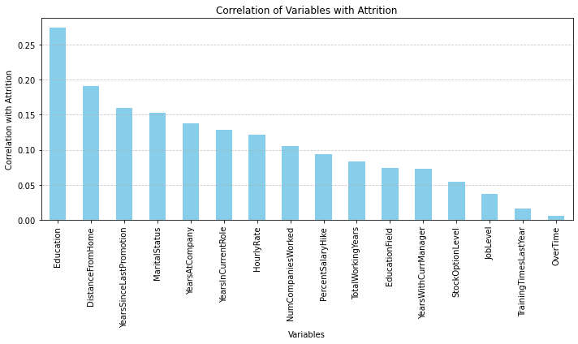
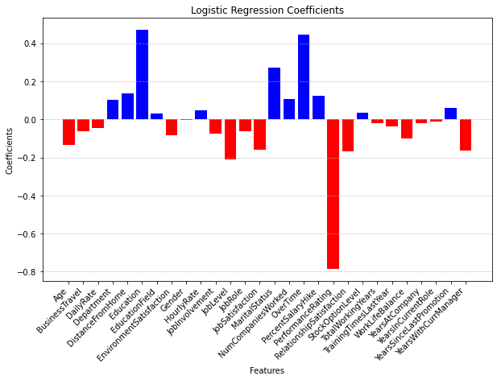
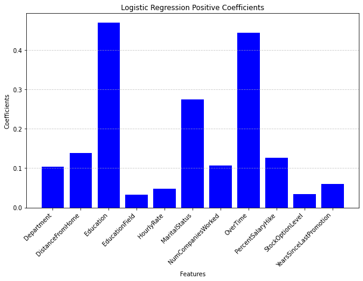
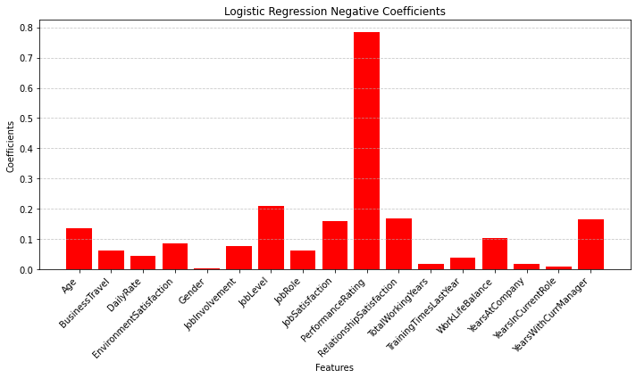

```python
#Our Libraries
import pandas as pd # used for handling the dataset
import numpy as np #used for handling numbers
import matplotlib.pyplot as plt

#Our tools
from sklearn.impute import SimpleImputer #handles missing data
from sklearn.preprocessing import LabelEncoder, OneHotEncoder, OrdinalEncoder #encoding categorical data
from sklearn.model_selection import train_test_split, cross_val_score #splitting training and testing data
from sklearn.preprocessing import StandardScaler, MinMaxScaler # feature scaling
from sklearn.linear_model import LogisticRegression # Logistic Regression
from sklearn.metrics import accuracy_score, precision_score, recall_score, f1_score #accuracy and precision
from scipy.stats import logistic
import statsmodels.api as sm
from sklearn.ensemble import RandomForestClassifier
print("Complete!")
```

    Complete!
    


```python
df1 = pd.read_csv(r'C:\Users\Public\Desktop\DAT-430\HRData (1).csv')
df2 = pd.read_csv(r'C:\Users\Public\Desktop\DAT-430\HRData (2).csv')
df3 = pd.read_csv(r'C:\Users\Public\Desktop\DAT-430\HRData (3).csv')
df4 = pd.read_csv(r'C:\Users\Public\Desktop\DAT-430\HRData (4).csv')
df5 = pd.read_csv(r'C:\Users\Public\Desktop\DAT-430\HRData (5).csv')
df6 = pd.read_csv(r'C:\Users\Public\Desktop\DAT-430\HRData (6).csv')
df7 = pd.read_csv(r'C:\Users\Public\Desktop\DAT-430\HRData (7).csv')
df8 = pd.read_csv(r'C:\Users\Public\Desktop\DAT-430\HRData (8).csv')
df9 = pd.read_csv(r'C:\Users\Public\Desktop\DAT-430\HRData (9).csv')
df10 = pd.read_csv(r'C:\Users\Public\Desktop\DAT-430\HRData (10).csv')
df11 = pd.read_csv(r'C:\Users\Public\Desktop\DAT-430\HRData (11).csv')
df12 = pd.read_csv(r'C:\Users\Public\Desktop\DAT-430\HRData (12).csv')
df13 = pd.read_csv(r'C:\Users\Public\Desktop\DAT-430\HRData (13).csv')
df14 = pd.read_csv(r'C:\Users\Public\Desktop\DAT-430\HRData (14).csv')
print("Complete")
```

    Complete
    


```python
total_rows =  (len(df1)+len(df2)+len(df3)+len(df4)+len(df5)+len(df6)+len(df7)+len(df8)+len(df9)+len(df10)+len(df11)+len(df12)+len(df13)+len(df14))
print("Total number of rows:", total_rows)
df = pd.concat([df1, df2, df3, df4, df5, df6, df7, df8, df9, df10, df11, df12, df13, df14], ignore_index=True)
df.info()
df.isnull().any()
```

    Total number of rows: 6040
    <class 'pandas.core.frame.DataFrame'>
    RangeIndex: 6040 entries, 0 to 6039
    Data columns (total 35 columns):
     #   Column                    Non-Null Count  Dtype 
    ---  ------                    --------------  ----- 
     0   Age                       6040 non-null   int64 
     1   BusinessTravel            6040 non-null   object
     2   DailyRate                 6040 non-null   int64 
     3   Department                6040 non-null   object
     4   DistanceFromHome          6040 non-null   int64 
     5   Education                 6040 non-null   object
     6   EducationField            6040 non-null   object
     7   EmployeeCount             6040 non-null   int64 
     8   EmployeeNumber            6040 non-null   object
     9   EnvironmentSatisfaction   6040 non-null   int64 
     10  Gender                    6040 non-null   object
     11  HourlyRate                6040 non-null   int64 
     12  JobInvolvement            6040 non-null   int64 
     13  JobLevel                  6040 non-null   int64 
     14  JobRole                   6040 non-null   object
     15  JobSatisfaction           6040 non-null   int64 
     16  MaritalStatus             6040 non-null   object
     17  MonthlyIncome             6040 non-null   object
     18  MonthlyRate               6040 non-null   object
     19  NumCompaniesWorked        6040 non-null   int64 
     20  Over18                    6040 non-null   object
     21  OverTime                  6040 non-null   object
     22  PercentSalaryHike         6040 non-null   int64 
     23  PerformanceRating         6040 non-null   int64 
     24  RelationshipSatisfaction  6040 non-null   int64 
     25  StandardHours             6040 non-null   int64 
     26  StockOptionLevel          6040 non-null   int64 
     27  TotalWorkingYears         6040 non-null   int64 
     28  TrainingTimesLastYear     6040 non-null   int64 
     29  WorkLifeBalance           6040 non-null   int64 
     30  YearsAtCompany            6040 non-null   int64 
     31  YearsInCurrentRole        6040 non-null   int64 
     32  YearsSinceLastPromotion   6040 non-null   int64 
     33  YearsWithCurrManager      6040 non-null   int64 
     34  Attrition                 5976 non-null   object
    dtypes: int64(22), object(13)
    memory usage: 1.6+ MB
    


    Age                         False
    BusinessTravel              False
    DailyRate                   False
    Department                  False
    DistanceFromHome            False
    Education                   False
    EducationField              False
    EmployeeCount               False
    EmployeeNumber              False
    EnvironmentSatisfaction     False
    Gender                      False
    HourlyRate                  False
    JobInvolvement              False
    JobLevel                    False
    JobRole                     False
    JobSatisfaction             False
    MaritalStatus               False
    MonthlyIncome               False
    MonthlyRate                 False
    NumCompaniesWorked          False
    Over18                      False
    OverTime                    False
    PercentSalaryHike           False
    PerformanceRating           False
    RelationshipSatisfaction    False
    StandardHours               False
    StockOptionLevel            False
    TotalWorkingYears           False
    TrainingTimesLastYear       False
    WorkLifeBalance             False
    YearsAtCompany              False
    YearsInCurrentRole          False
    YearsSinceLastPromotion     False
    YearsWithCurrManager        False
    Attrition                    True
    dtype: bool


```python
file_path = r"\\apporto.com\dfs\SNHU\USERS\margotsmith_snhu\project1_raw.csv"
df.to_csv(file_path, index=False)
print("complete")
```

    complete
    


```python
#boolean mask for missing values
missing_mask = df.isnull().any(axis=1)
#filter the rows and print
rows_with_missing_data = df[missing_mask]
print(rows_with_missing_data)
```

          Age     BusinessTravel  DailyRate              Department  \
    2098   60  Travel_Frequently       1224                   Sales   
    3577   25         Non-Travel       1383  Research & Development   
    3622   37      Travel_Rarely        353                   Sales   
    3623   18  Travel_Frequently        995                   Sales   
    3635   33  Travel_Frequently        377         Human Resources   
    ...   ...                ...        ...                     ...   
    4524   52         Non-Travel       1026         Human Resources   
    4533   27  Travel_Frequently        649                   Sales   
    4535   52      Travel_Rarely        835         Human Resources   
    4539   19      Travel_Rarely        927  Research & Development   
    4547   35      Travel_Rarely       1299         Human Resources   
    
          DistanceFromHome Education    EducationField  EmployeeCount  \
    2098                46        16           Medical              1   
    3577                24        16  Technical Degree              1   
    3622                49        14             Sales              1   
    3623                19        18             Other              1   
    3635                50        16             Other              1   
    ...                ...       ...               ...            ...   
    4524                44        14             Sales              1   
    4533                30        14             Sales              1   
    4535                 6        14             Sales              1   
    4539                34        16             Sales              1   
    4547                10        20  Technical Degree              1   
    
         EmployeeNumber  EnvironmentSatisfaction  ... StandardHours  \
    2098     83-1865147                        2  ...            80   
    3577     15-5986082                        2  ...            80   
    3622     52-8998188                        3  ...            80   
    3623     21-5958459                        1  ...            80   
    3635     20-5373328                        2  ...            80   
    ...             ...                      ...  ...           ...   
    4524     39-2669248                        4  ...            80   
    4533     30-7869553                        3  ...            80   
    4535     29-8893058                        2  ...            80   
    4539     52-5036516                        1  ...            80   
    4547     35-9764025                        1  ...            80   
    
          StockOptionLevel  TotalWorkingYears  TrainingTimesLastYear  \
    2098                 0                 21                      0   
    3577                 0                 10                      6   
    3622                 0                  9                      6   
    3623                 0                  3                      6   
    3635                 3                  0                      6   
    ...                ...                ...                    ...   
    4524                 1                  8                      5   
    4533                 1                  0                      3   
    4535                 2                  5                      5   
    4539                 0                  0                      4   
    4547                 0                  3                      4   
    
         WorkLifeBalance  YearsAtCompany YearsInCurrentRole  \
    2098               2              32                  4   
    3577               4              33                  0   
    3622               4              35                  0   
    3623               3              33                  5   
    3635               4              16                  8   
    ...              ...             ...                ...   
    4524               4               8                 19   
    4533               4              16                 18   
    4535               2               5                 12   
    4539               3              14                 14   
    4547               4               0                  0   
    
         YearsSinceLastPromotion YearsWithCurrManager  Attrition  
    2098                      10                    1        NaN  
    3577                      15                   15        NaN  
    3622                      13                    6        NaN  
    3623                      11                   11        NaN  
    3635                       9                   14        NaN  
    ...                      ...                  ...        ...  
    4524                      10                    7        NaN  
    4533                      11                    4        NaN  
    4535                       5                   10        NaN  
    4539                       1                    5        NaN  
    4547                      13                    6        NaN  
    
    [64 rows x 35 columns]
    


```python
df = df.dropna()
df.info()
```

    <class 'pandas.core.frame.DataFrame'>
    Int64Index: 5976 entries, 0 to 6039
    Data columns (total 35 columns):
     #   Column                    Non-Null Count  Dtype 
    ---  ------                    --------------  ----- 
     0   Age                       5976 non-null   int64 
     1   BusinessTravel            5976 non-null   object
     2   DailyRate                 5976 non-null   int64 
     3   Department                5976 non-null   object
     4   DistanceFromHome          5976 non-null   int64 
     5   Education                 5976 non-null   object
     6   EducationField            5976 non-null   object
     7   EmployeeCount             5976 non-null   int64 
     8   EmployeeNumber            5976 non-null   object
     9   EnvironmentSatisfaction   5976 non-null   int64 
     10  Gender                    5976 non-null   object
     11  HourlyRate                5976 non-null   int64 
     12  JobInvolvement            5976 non-null   int64 
     13  JobLevel                  5976 non-null   int64 
     14  JobRole                   5976 non-null   object
     15  JobSatisfaction           5976 non-null   int64 
     16  MaritalStatus             5976 non-null   object
     17  MonthlyIncome             5976 non-null   object
     18  MonthlyRate               5976 non-null   object
     19  NumCompaniesWorked        5976 non-null   int64 
     20  Over18                    5976 non-null   object
     21  OverTime                  5976 non-null   object
     22  PercentSalaryHike         5976 non-null   int64 
     23  PerformanceRating         5976 non-null   int64 
     24  RelationshipSatisfaction  5976 non-null   int64 
     25  StandardHours             5976 non-null   int64 
     26  StockOptionLevel          5976 non-null   int64 
     27  TotalWorkingYears         5976 non-null   int64 
     28  TrainingTimesLastYear     5976 non-null   int64 
     29  WorkLifeBalance           5976 non-null   int64 
     30  YearsAtCompany            5976 non-null   int64 
     31  YearsInCurrentRole        5976 non-null   int64 
     32  YearsSinceLastPromotion   5976 non-null   int64 
     33  YearsWithCurrManager      5976 non-null   int64 
     34  Attrition                 5976 non-null   object
    dtypes: int64(22), object(13)
    memory usage: 1.6+ MB
    


```python
df.isnull().any().any()
```


    False


```python
for column in df.columns:
    print(f"{column}: {df[column].unique()}")
```

    Age: [20 45 27 41 48 47 51 55 44 33 52 25 34 37 18 35 32 54 40 57 36 23 59 31
     24 38 30 39 50 42 29 26 53 28 49 43 60 56 22 58 21 19 46]
    BusinessTravel: ['Non-Travel' 'Travel_Frequently' 'Travel_Rarely']
    DailyRate: [ 870  458  871 ...  449 1263  774]
    Department: ['Human Resources' 'Research & Development' 'Sales']
    DistanceFromHome: [44 39 23 24 36 16 45 43 26 50 37 30 34 38  7  8  5 48 47  9 14 41 13 12
     31  2 10 42 20 27 19  4 49 15  6 22  3 21 28 17 11 46  1 18 25 29 33 35
     32 40]
    Education: [2 4 1 3 "error: Field 'JobRole' not found" 14 16 12 18 20 5]
    EducationField: ['Human Resources' 'Life Sciences' 'Technical Degree' 'Other' 'Sales'
     'Medical' 'Marketing']
    EmployeeCount: [1]
    EmployeeNumber: ['68-5716114' '09-4992202' '95-3976742' ... '2064' '2065' '2068']
    EnvironmentSatisfaction: [1 3 4 2]
    Gender: ['M' 'F' 'Female' 'Male']
    HourlyRate: [126  75 123 140 116 138  94  40  93 113  79  74 130  77 102 110  88  73
     132 142 105  31 150  98 131 148  54  55  51 139  95  59  72  70  71 141
      53  69  58  97 109 111 117  47 106 146 114  87 144 100  91  36  33 137
      80 147 135 103  57 145  90  67  89  39 108  61  52  56 124  62  65 129
     107 136 122 112  38  43  63  66  35  96  45 125  37 127  46 128  48 149
      83  68  78  86  50 121 104  84 133  49  30 143 101 118  32  99  81  82
     120  76  85  34  42 119  60 134 115  92  41  44  64]
    JobInvolvement: [4 2 1 3]
    JobLevel: [2 3 5 1 4]
    JobRole: ['Manager' 'Research Scientist' 'Sales Executive' 'Sales Representative'
     'Laboratory Technician' 'Human Resources' 'Manufacturing Director'
     'Research Director' 'Healthcare Representative']
    JobSatisfaction: [3 2 4 1]
    MaritalStatus: ['Married' 'Single' 'Divorced']
    MonthlyIncome: ["Syntax error in formula '((HourlyRate * 160)*.2) + (HourlyRate * 160) '"
     "Syntax error in formula '((field('HourlyRate') * 160)*.2) + (field('HourlyRate') * 160) '"
     "Syntax error in formula 'field('MonthlyRate') * .8'" ... 9991 5390 4404]
    MonthlyRate: ["error: Please use field('HourlyRate') to access HourlyRate because it starts with an upper case letter."
     14880 18080 ... 5174 13243 10228]
    NumCompaniesWorked: [6 3 1 8 4 7 5 0 2 9]
    Over18: ['Yes' 'Y']
    OverTime: ['No' 'Yes']
    PercentSalaryHike: [13 25 12 10 22 20 11 18 19 15 23 24 16 17 14 21]
    PerformanceRating: [2 1 3 4]
    RelationshipSatisfaction: [4 1 2 3]
    StandardHours: [80]
    StockOptionLevel: [0 2 3 1]
    TotalWorkingYears: [27 38 39 19 12 22 34 40 14  0 35  8  4 23 11 24 16 31  9  7 33 17 29 13
      3 28 32 15 18 20 25  5  6 21 26  1 10  2 30 36 37]
    TrainingTimesLastYear: [5 3 0 6 1 4 2]
    WorkLifeBalance: [2 4 3 1]
    YearsAtCompany: [ 8 36 32 10 25 34 31 28 14 15 24  2 19 20  7 38 27 37  1 23 33 18  0 13
      3 29 40 17 35  9  6 26 22 21 39  5 11 30 16 12  4]
    YearsInCurrentRole: [ 2 15 18  6 20  3 17  4 13 10  8 19  5 14  7  9  0 12 16  1 11]
    YearsSinceLastPromotion: [ 0  2 10  7  4  8  5  1  9  6 15 13  3 12 11 14]
    YearsWithCurrManager: [14 12  8 15  9 13  2 17  7  0 11  4  5  3  1 10 16  6]
    Attrition: ['No' 'Yes']
    


```python
print(df.MonthlyIncome)
print(df.MonthlyRate)
print(df.Education)
```

    0       Syntax error in formula '((HourlyRate * 160)*....
    1       Syntax error in formula '((HourlyRate * 160)*....
    2       Syntax error in formula '((HourlyRate * 160)*....
    3       Syntax error in formula '((HourlyRate * 160)*....
    4       Syntax error in formula '((HourlyRate * 160)*....
                                  ...                        
    6035                                                 2571
    6036                                                 9991
    6037                                                 6142
    6038                                                 5390
    6039                                                 4404
    Name: MonthlyIncome, Length: 5976, dtype: object
    0       error: Please use field('HourlyRate') to acces...
    1       error: Please use field('HourlyRate') to acces...
    2       error: Please use field('HourlyRate') to acces...
    3       error: Please use field('HourlyRate') to acces...
    4       error: Please use field('HourlyRate') to acces...
                                  ...                        
    6035                                                12290
    6036                                                21457
    6037                                                 5174
    6038                                                13243
    6039                                                10228
    Name: MonthlyRate, Length: 5976, dtype: object
    0       2
    1       4
    2       1
    3       1
    4       2
           ..
    6035    2
    6036    1
    6037    3
    6038    3
    6039    3
    Name: Education, Length: 5976, dtype: object
    


```python
df = df.drop(["MonthlyIncome", "MonthlyRate"], axis=1)
df.info()
```

    <class 'pandas.core.frame.DataFrame'>
    Int64Index: 5976 entries, 0 to 6039
    Data columns (total 33 columns):
     #   Column                    Non-Null Count  Dtype 
    ---  ------                    --------------  ----- 
     0   Age                       5976 non-null   int64 
     1   BusinessTravel            5976 non-null   object
     2   DailyRate                 5976 non-null   int64 
     3   Department                5976 non-null   object
     4   DistanceFromHome          5976 non-null   int64 
     5   Education                 5976 non-null   object
     6   EducationField            5976 non-null   object
     7   EmployeeCount             5976 non-null   int64 
     8   EmployeeNumber            5976 non-null   object
     9   EnvironmentSatisfaction   5976 non-null   int64 
     10  Gender                    5976 non-null   object
     11  HourlyRate                5976 non-null   int64 
     12  JobInvolvement            5976 non-null   int64 
     13  JobLevel                  5976 non-null   int64 
     14  JobRole                   5976 non-null   object
     15  JobSatisfaction           5976 non-null   int64 
     16  MaritalStatus             5976 non-null   object
     17  NumCompaniesWorked        5976 non-null   int64 
     18  Over18                    5976 non-null   object
     19  OverTime                  5976 non-null   object
     20  PercentSalaryHike         5976 non-null   int64 
     21  PerformanceRating         5976 non-null   int64 
     22  RelationshipSatisfaction  5976 non-null   int64 
     23  StandardHours             5976 non-null   int64 
     24  StockOptionLevel          5976 non-null   int64 
     25  TotalWorkingYears         5976 non-null   int64 
     26  TrainingTimesLastYear     5976 non-null   int64 
     27  WorkLifeBalance           5976 non-null   int64 
     28  YearsAtCompany            5976 non-null   int64 
     29  YearsInCurrentRole        5976 non-null   int64 
     30  YearsSinceLastPromotion   5976 non-null   int64 
     31  YearsWithCurrManager      5976 non-null   int64 
     32  Attrition                 5976 non-null   object
    dtypes: int64(22), object(11)
    memory usage: 1.6+ MB
    


```python
print(df['Education'].unique())
```

    [2 4 1 3 "error: Field 'JobRole' not found" 14 16 12 18 20 5]
    


```python
invalid_education_rows = df[df['Education'] == "error: Field 'JobRole' not found"]
print(invalid_education_rows)
```

        Age     BusinessTravel  DailyRate              Department  \
    30   40      Travel_Rarely       1388         Human Resources   
    31   52  Travel_Frequently       1210                   Sales   
    32   31         Non-Travel        878  Research & Development   
    33   24      Travel_Rarely        756                   Sales   
    34   27         Non-Travel        429                   Sales   
    35   38      Travel_Rarely        422         Human Resources   
    36   30         Non-Travel        973         Human Resources   
    37   54      Travel_Rarely       1223         Human Resources   
    38   31  Travel_Frequently       1261  Research & Development   
    39   27  Travel_Frequently       1264                   Sales   
    
        DistanceFromHome                         Education    EducationField  \
    30                42  error: Field 'JobRole' not found     Life Sciences   
    31                13  error: Field 'JobRole' not found     Life Sciences   
    32                20  error: Field 'JobRole' not found             Other   
    33                34  error: Field 'JobRole' not found             Other   
    34                27  error: Field 'JobRole' not found     Life Sciences   
    35                42  error: Field 'JobRole' not found           Medical   
    36                39  error: Field 'JobRole' not found     Life Sciences   
    37                26  error: Field 'JobRole' not found             Sales   
    38                 9  error: Field 'JobRole' not found             Other   
    39                19  error: Field 'JobRole' not found  Technical Degree   
    
        EmployeeCount EmployeeNumber  EnvironmentSatisfaction  ... StandardHours  \
    30              1     17-1590227                        4  ...            80   
    31              1     11-8431387                        4  ...            80   
    32              1     86-5146539                        4  ...            80   
    33              1     85-9386105                        4  ...            80   
    34              1     74-4654004                        1  ...            80   
    35              1     42-4562952                        1  ...            80   
    36              1     89-5219052                        2  ...            80   
    37              1     18-6958191                        3  ...            80   
    38              1     42-9889531                        3  ...            80   
    39              1     41-5852957                        2  ...            80   
    
        StockOptionLevel  TotalWorkingYears  TrainingTimesLastYear  \
    30                 2                 13                      1   
    31                 0                  3                      2   
    32                 3                 27                      5   
    33                 1                  4                      1   
    34                 2                 19                      4   
    35                 1                 28                      0   
    36                 1                 13                      4   
    37                 0                 32                      2   
    38                 2                 32                      2   
    39                 1                 13                      5   
    
       WorkLifeBalance  YearsAtCompany YearsInCurrentRole  \
    30               3              33                  0   
    31               3              18                 13   
    32               2               0                 15   
    33               3              13                  5   
    34               1               3                  4   
    35               4              13                  3   
    36               2              29                 12   
    37               3              40                  7   
    38               3              34                 13   
    39               3              23                 14   
    
        YearsSinceLastPromotion YearsWithCurrManager Attrition  
    30                        0                    3        No  
    31                        4                    7       Yes  
    32                        2                    4       Yes  
    33                       11                    9        No  
    34                        8                   13       Yes  
    35                        6                   10       Yes  
    36                        3                    1       Yes  
    37                       14                    7        No  
    38                        5                   10        No  
    39                       10                   11       Yes  
    
    [10 rows x 33 columns]
    


```python
# set the error rows
error_rows = df[df['Education'] == "error: Field 'JobRole' not found"]
#remove errors
df= df.drop(index=error_rows.index)
#convert from object to int
df['Education'] = pd.to_numeric(df['Education'])
df.info()
```

    <class 'pandas.core.frame.DataFrame'>
    Int64Index: 5966 entries, 0 to 6039
    Data columns (total 33 columns):
     #   Column                    Non-Null Count  Dtype 
    ---  ------                    --------------  ----- 
     0   Age                       5966 non-null   int64 
     1   BusinessTravel            5966 non-null   object
     2   DailyRate                 5966 non-null   int64 
     3   Department                5966 non-null   object
     4   DistanceFromHome          5966 non-null   int64 
     5   Education                 5966 non-null   int64 
     6   EducationField            5966 non-null   object
     7   EmployeeCount             5966 non-null   int64 
     8   EmployeeNumber            5966 non-null   object
     9   EnvironmentSatisfaction   5966 non-null   int64 
     10  Gender                    5966 non-null   object
     11  HourlyRate                5966 non-null   int64 
     12  JobInvolvement            5966 non-null   int64 
     13  JobLevel                  5966 non-null   int64 
     14  JobRole                   5966 non-null   object
     15  JobSatisfaction           5966 non-null   int64 
     16  MaritalStatus             5966 non-null   object
     17  NumCompaniesWorked        5966 non-null   int64 
     18  Over18                    5966 non-null   object
     19  OverTime                  5966 non-null   object
     20  PercentSalaryHike         5966 non-null   int64 
     21  PerformanceRating         5966 non-null   int64 
     22  RelationshipSatisfaction  5966 non-null   int64 
     23  StandardHours             5966 non-null   int64 
     24  StockOptionLevel          5966 non-null   int64 
     25  TotalWorkingYears         5966 non-null   int64 
     26  TrainingTimesLastYear     5966 non-null   int64 
     27  WorkLifeBalance           5966 non-null   int64 
     28  YearsAtCompany            5966 non-null   int64 
     29  YearsInCurrentRole        5966 non-null   int64 
     30  YearsSinceLastPromotion   5966 non-null   int64 
     31  YearsWithCurrManager      5966 non-null   int64 
     32  Attrition                 5966 non-null   object
    dtypes: int64(23), object(10)
    memory usage: 1.5+ MB
    


```python
df = df.drop(["EmployeeCount", "Over18", "StandardHours", "EmployeeNumber"], axis=1)
df.info()
```

    <class 'pandas.core.frame.DataFrame'>
    Int64Index: 5966 entries, 0 to 6039
    Data columns (total 29 columns):
     #   Column                    Non-Null Count  Dtype 
    ---  ------                    --------------  ----- 
     0   Age                       5966 non-null   int64 
     1   BusinessTravel            5966 non-null   object
     2   DailyRate                 5966 non-null   int64 
     3   Department                5966 non-null   object
     4   DistanceFromHome          5966 non-null   int64 
     5   Education                 5966 non-null   int64 
     6   EducationField            5966 non-null   object
     7   EnvironmentSatisfaction   5966 non-null   int64 
     8   Gender                    5966 non-null   object
     9   HourlyRate                5966 non-null   int64 
     10  JobInvolvement            5966 non-null   int64 
     11  JobLevel                  5966 non-null   int64 
     12  JobRole                   5966 non-null   object
     13  JobSatisfaction           5966 non-null   int64 
     14  MaritalStatus             5966 non-null   object
     15  NumCompaniesWorked        5966 non-null   int64 
     16  OverTime                  5966 non-null   object
     17  PercentSalaryHike         5966 non-null   int64 
     18  PerformanceRating         5966 non-null   int64 
     19  RelationshipSatisfaction  5966 non-null   int64 
     20  StockOptionLevel          5966 non-null   int64 
     21  TotalWorkingYears         5966 non-null   int64 
     22  TrainingTimesLastYear     5966 non-null   int64 
     23  WorkLifeBalance           5966 non-null   int64 
     24  YearsAtCompany            5966 non-null   int64 
     25  YearsInCurrentRole        5966 non-null   int64 
     26  YearsSinceLastPromotion   5966 non-null   int64 
     27  YearsWithCurrManager      5966 non-null   int64 
     28  Attrition                 5966 non-null   object
    dtypes: int64(21), object(8)
    memory usage: 1.4+ MB
    


```python
print(df)
```

          Age     BusinessTravel  DailyRate              Department  \
    0      20         Non-Travel        870         Human Resources   
    1      45         Non-Travel        458         Human Resources   
    2      27  Travel_Frequently        871         Human Resources   
    3      41         Non-Travel       1237  Research & Development   
    4      48         Non-Travel        882         Human Resources   
    ...   ...                ...        ...                     ...   
    6035   36  Travel_Frequently        884  Research & Development   
    6036   39      Travel_Rarely        613  Research & Development   
    6037   27      Travel_Rarely        155  Research & Development   
    6038   49  Travel_Frequently       1023                   Sales   
    6039   34      Travel_Rarely        628  Research & Development   
    
          DistanceFromHome  Education    EducationField  EnvironmentSatisfaction  \
    0                   44          2   Human Resources                        1   
    1                   39          4   Human Resources                        3   
    2                   23          1     Life Sciences                        4   
    3                   44          1   Human Resources                        3   
    4                   24          2  Technical Degree                        4   
    ...                ...        ...               ...                      ...   
    6035                23          2           Medical                        3   
    6036                 6          1           Medical                        4   
    6037                 4          3     Life Sciences                        2   
    6038                 2          3           Medical                        4   
    6039                 8          3           Medical                        2   
    
         Gender  HourlyRate  ...  RelationshipSatisfaction  StockOptionLevel  \
    0         M         126  ...                         4                 0   
    1         M          75  ...                         4                 2   
    2         F         123  ...                         1                 3   
    3         F         140  ...                         1                 1   
    4         F         116  ...                         2                 3   
    ...     ...         ...  ...                       ...               ...   
    6035   Male          41  ...                         3                 1   
    6036   Male          42  ...                         1                 1   
    6037   Male          87  ...                         2                 1   
    6038   Male          63  ...                         4                 0   
    6039   Male          82  ...                         1                 0   
    
         TotalWorkingYears  TrainingTimesLastYear WorkLifeBalance  YearsAtCompany  \
    0                   27                      5               2               8   
    1                   38                      3               4              36   
    2                   39                      0               3              32   
    3                   38                      6               3              10   
    4                   19                      5               2              10   
    ...                ...                    ...             ...             ...   
    6035                17                      3               3               5   
    6036                 9                      5               3               7   
    6037                 6                      0               3               6   
    6038                17                      3               2               9   
    6039                 6                      3               4               4   
    
         YearsInCurrentRole  YearsSinceLastPromotion  YearsWithCurrManager  \
    0                     2                        0                    14   
    1                    15                        2                    12   
    2                    18                        0                     8   
    3                    18                       10                    12   
    4                     6                        7                    15   
    ...                 ...                      ...                   ...   
    6035                  2                        0                     3   
    6036                  7                        1                     7   
    6037                  2                        0                     3   
    6038                  6                        0                     8   
    6039                  3                        1                     2   
    
          Attrition  
    0            No  
    1            No  
    2           Yes  
    3           Yes  
    4           Yes  
    ...         ...  
    6035         No  
    6036         No  
    6037         No  
    6038         No  
    6039         No  
    
    [5966 rows x 29 columns]
    


```python
file_path = r"\\apporto.com\dfs\SNHU\USERS\margotsmith_snhu\project1_tableau.xlsx"
df.to_excel(file_path, index=False)
print("complete")
```

    complete
    


```python
df['Attrition'] = df['Attrition'].map({'No':0, 'Yes':1})
df['Attrition'] = df['Attrition'].astype(int)
df.info()
```

    <class 'pandas.core.frame.DataFrame'>
    Int64Index: 5966 entries, 0 to 6039
    Data columns (total 29 columns):
     #   Column                    Non-Null Count  Dtype 
    ---  ------                    --------------  ----- 
     0   Age                       5966 non-null   int64 
     1   BusinessTravel            5966 non-null   object
     2   DailyRate                 5966 non-null   int64 
     3   Department                5966 non-null   object
     4   DistanceFromHome          5966 non-null   int64 
     5   Education                 5966 non-null   int64 
     6   EducationField            5966 non-null   object
     7   EnvironmentSatisfaction   5966 non-null   int64 
     8   Gender                    5966 non-null   object
     9   HourlyRate                5966 non-null   int64 
     10  JobInvolvement            5966 non-null   int64 
     11  JobLevel                  5966 non-null   int64 
     12  JobRole                   5966 non-null   object
     13  JobSatisfaction           5966 non-null   int64 
     14  MaritalStatus             5966 non-null   object
     15  NumCompaniesWorked        5966 non-null   int64 
     16  OverTime                  5966 non-null   object
     17  PercentSalaryHike         5966 non-null   int64 
     18  PerformanceRating         5966 non-null   int64 
     19  RelationshipSatisfaction  5966 non-null   int64 
     20  StockOptionLevel          5966 non-null   int64 
     21  TotalWorkingYears         5966 non-null   int64 
     22  TrainingTimesLastYear     5966 non-null   int64 
     23  WorkLifeBalance           5966 non-null   int64 
     24  YearsAtCompany            5966 non-null   int64 
     25  YearsInCurrentRole        5966 non-null   int64 
     26  YearsSinceLastPromotion   5966 non-null   int64 
     27  YearsWithCurrManager      5966 non-null   int64 
     28  Attrition                 5966 non-null   int32 
    dtypes: int32(1), int64(21), object(7)
    memory usage: 1.3+ MB
    


```python
df.Attrition.value_counts()
```


    0    4183
    1    1783
    Name: Attrition, dtype: int64


```python
print(df)
```

          Age     BusinessTravel  DailyRate              Department  \
    0      20         Non-Travel        870         Human Resources   
    1      45         Non-Travel        458         Human Resources   
    2      27  Travel_Frequently        871         Human Resources   
    3      41         Non-Travel       1237  Research & Development   
    4      48         Non-Travel        882         Human Resources   
    ...   ...                ...        ...                     ...   
    6035   36  Travel_Frequently        884  Research & Development   
    6036   39      Travel_Rarely        613  Research & Development   
    6037   27      Travel_Rarely        155  Research & Development   
    6038   49  Travel_Frequently       1023                   Sales   
    6039   34      Travel_Rarely        628  Research & Development   
    
          DistanceFromHome  Education    EducationField  EnvironmentSatisfaction  \
    0                   44          2   Human Resources                        1   
    1                   39          4   Human Resources                        3   
    2                   23          1     Life Sciences                        4   
    3                   44          1   Human Resources                        3   
    4                   24          2  Technical Degree                        4   
    ...                ...        ...               ...                      ...   
    6035                23          2           Medical                        3   
    6036                 6          1           Medical                        4   
    6037                 4          3     Life Sciences                        2   
    6038                 2          3           Medical                        4   
    6039                 8          3           Medical                        2   
    
         Gender  HourlyRate  ...  RelationshipSatisfaction  StockOptionLevel  \
    0         M         126  ...                         4                 0   
    1         M          75  ...                         4                 2   
    2         F         123  ...                         1                 3   
    3         F         140  ...                         1                 1   
    4         F         116  ...                         2                 3   
    ...     ...         ...  ...                       ...               ...   
    6035   Male          41  ...                         3                 1   
    6036   Male          42  ...                         1                 1   
    6037   Male          87  ...                         2                 1   
    6038   Male          63  ...                         4                 0   
    6039   Male          82  ...                         1                 0   
    
         TotalWorkingYears  TrainingTimesLastYear WorkLifeBalance  YearsAtCompany  \
    0                   27                      5               2               8   
    1                   38                      3               4              36   
    2                   39                      0               3              32   
    3                   38                      6               3              10   
    4                   19                      5               2              10   
    ...                ...                    ...             ...             ...   
    6035                17                      3               3               5   
    6036                 9                      5               3               7   
    6037                 6                      0               3               6   
    6038                17                      3               2               9   
    6039                 6                      3               4               4   
    
         YearsInCurrentRole  YearsSinceLastPromotion  YearsWithCurrManager  \
    0                     2                        0                    14   
    1                    15                        2                    12   
    2                    18                        0                     8   
    3                    18                       10                    12   
    4                     6                        7                    15   
    ...                 ...                      ...                   ...   
    6035                  2                        0                     3   
    6036                  7                        1                     7   
    6037                  2                        0                     3   
    6038                  6                        0                     8   
    6039                  3                        1                     2   
    
          Attrition  
    0             0  
    1             0  
    2             1  
    3             1  
    4             1  
    ...         ...  
    6035          0  
    6036          0  
    6037          0  
    6038          0  
    6039          0  
    
    [5966 rows x 29 columns]
    


```python
label_encoder = LabelEncoder()

df['BusinessTravel'] = label_encoder.fit_transform(df['BusinessTravel'])
df['Department'] = label_encoder.fit_transform(df['Department'])
df['EducationField'] = label_encoder.fit_transform(df['EducationField'])
df['Gender'] = label_encoder.fit_transform(df['Gender'])
df['JobRole'] = label_encoder.fit_transform(df['JobRole'])
df['MaritalStatus'] = label_encoder.fit_transform(df['MaritalStatus'])
df['OverTime'] = label_encoder.fit_transform(df['OverTime'])

print(df.head())
```

       Age  BusinessTravel  DailyRate  Department  DistanceFromHome  Education  \
    0   20               0        870           0                44          2   
    1   45               0        458           0                39          4   
    2   27               1        871           0                23          1   
    3   41               0       1237           1                44          1   
    4   48               0        882           0                24          2   
    
       EducationField  EnvironmentSatisfaction  Gender  HourlyRate  ...  \
    0               0                        1       2         126  ...   
    1               0                        3       2          75  ...   
    2               1                        4       0         123  ...   
    3               0                        3       0         140  ...   
    4               6                        4       0         116  ...   
    
       RelationshipSatisfaction  StockOptionLevel  TotalWorkingYears  \
    0                         4                 0                 27   
    1                         4                 2                 38   
    2                         1                 3                 39   
    3                         1                 1                 38   
    4                         2                 3                 19   
    
       TrainingTimesLastYear  WorkLifeBalance  YearsAtCompany  YearsInCurrentRole  \
    0                      5                2               8                   2   
    1                      3                4              36                  15   
    2                      0                3              32                  18   
    3                      6                3              10                  18   
    4                      5                2              10                   6   
    
       YearsSinceLastPromotion  YearsWithCurrManager  Attrition  
    0                        0                    14          0  
    1                        2                    12          0  
    2                        0                     8          1  
    3                       10                    12          1  
    4                        7                    15          1  
    
    [5 rows x 29 columns]
    


```python
file_path = r"\\apporto.com\dfs\SNHU\USERS\margotsmith_snhu\project1_eda_ready.csv"
df.to_csv(file_path, index=False)
print("complete")
```

    complete
    


```python
#create corrletaion matrix
corr_with_attrition = df.drop(columns=['Attrition']).corrwith(df['Attrition']).sort_values(ascending=False)
#positive correlations only
positive_corr_with_attrition = corr_with_attrition[corr_with_attrition >= 0]

#Plot
plt.figure(figsize=(10,6))
positive_corr_with_attrition.plot(kind='bar', color='skyblue')
plt.title('Correlation of Variables with Attrition')
plt.xlabel('Variables')
plt.ylabel('Correlation with Attrition')
plt.xticks(rotation=90)
plt.grid(axis='y', linestyle='--', alpha=0.7)
plt.tight_layout()
plt.show()
```





```python
#our threshold will be for signifcance
threshold = 0.05

significant_correlations = corr_with_attrition[abs(corr_with_attrition) >= threshold]

for variable, correlation in significant_correlations.items():
    print(f"{variable}: {correlation}")

print(significant_correlations)
```

    Education: 0.2736804438050035
    DistanceFromHome: 0.1903873902856801
    YearsSinceLastPromotion: 0.15913907411057093
    MaritalStatus: 0.15273321923049485
    YearsAtCompany: 0.13753488077032983
    YearsInCurrentRole: 0.12793135793535598
    HourlyRate: 0.12198576424163642
    NumCompaniesWorked: 0.10547252327217077
    PercentSalaryHike: 0.09382201698706112
    TotalWorkingYears: 0.08286203474542371
    EducationField: 0.07461400636611831
    YearsWithCurrManager: 0.07331968806934282
    StockOptionLevel: 0.05447022090391571
    EnvironmentSatisfaction: -0.06280075446069874
    JobSatisfaction: -0.06472952876797008
    JobInvolvement: -0.06527537911299085
    WorkLifeBalance: -0.07766356736080186
    BusinessTravel: -0.11309302316764772
    RelationshipSatisfaction: -0.11646997630627655
    Gender: -0.15121239653738058
    PerformanceRating: -0.3908783815348124
    Education                   0.273680
    DistanceFromHome            0.190387
    YearsSinceLastPromotion     0.159139
    MaritalStatus               0.152733
    YearsAtCompany              0.137535
    YearsInCurrentRole          0.127931
    HourlyRate                  0.121986
    NumCompaniesWorked          0.105473
    PercentSalaryHike           0.093822
    TotalWorkingYears           0.082862
    EducationField              0.074614
    YearsWithCurrManager        0.073320
    StockOptionLevel            0.054470
    EnvironmentSatisfaction    -0.062801
    JobSatisfaction            -0.064730
    JobInvolvement             -0.065275
    WorkLifeBalance            -0.077664
    BusinessTravel             -0.113093
    RelationshipSatisfaction   -0.116470
    Gender                     -0.151212
    PerformanceRating          -0.390878
    dtype: float64
    


```python
#Set independent and dependent variables
x = df.drop(columns=['Attrition'])
y = df['Attrition']
print("Complete")
```

    Complete
    


```python
# splitting the dataset into training set and test set
x_train, x_test, y_train, y_test = train_test_split(x, y, test_size=0.2, random_state=0)
print("Complete!")
```

    Complete!
    


```python
file_path = r"\\apporto.com\dfs\SNHU\USERS\margotsmith_snhu\project1_tableau.xlsx"
df.to_excel(file_path, index=False)
print("complete")
```

    complete
    


```python
file_path = r"\\apporto.com\dfs\SNHU\USERS\margotsmith_snhu\project1_eda_ready.csv"
df.to_csv(file_path, index=False)
print("complete")
```

    complete
    


```python
# feature scaling
scaler = StandardScaler()
x_train = scaler.fit_transform(x_train)
x_test = scaler.transform(x_test)
#print("Complete!")
```


```python
#scaler = MinMaxScaler()
#x_train = scaler.fit_transform(x_train)
#x_test = scaler.transform(x_test)
```


```python
df.info()
```

    <class 'pandas.core.frame.DataFrame'>
    Int64Index: 5966 entries, 0 to 6039
    Data columns (total 29 columns):
     #   Column                    Non-Null Count  Dtype
    ---  ------                    --------------  -----
     0   Age                       5966 non-null   int64
     1   BusinessTravel            5966 non-null   int32
     2   DailyRate                 5966 non-null   int64
     3   Department                5966 non-null   int32
     4   DistanceFromHome          5966 non-null   int64
     5   Education                 5966 non-null   int64
     6   EducationField            5966 non-null   int32
     7   EnvironmentSatisfaction   5966 non-null   int64
     8   Gender                    5966 non-null   int32
     9   HourlyRate                5966 non-null   int64
     10  JobInvolvement            5966 non-null   int64
     11  JobLevel                  5966 non-null   int64
     12  JobRole                   5966 non-null   int32
     13  JobSatisfaction           5966 non-null   int64
     14  MaritalStatus             5966 non-null   int32
     15  NumCompaniesWorked        5966 non-null   int64
     16  OverTime                  5966 non-null   int32
     17  PercentSalaryHike         5966 non-null   int64
     18  PerformanceRating         5966 non-null   int64
     19  RelationshipSatisfaction  5966 non-null   int64
     20  StockOptionLevel          5966 non-null   int64
     21  TotalWorkingYears         5966 non-null   int64
     22  TrainingTimesLastYear     5966 non-null   int64
     23  WorkLifeBalance           5966 non-null   int64
     24  YearsAtCompany            5966 non-null   int64
     25  YearsInCurrentRole        5966 non-null   int64
     26  YearsSinceLastPromotion   5966 non-null   int64
     27  YearsWithCurrManager      5966 non-null   int64
     28  Attrition                 5966 non-null   int32
    dtypes: int32(8), int64(21)
    memory usage: 1.2 MB
    


```python
#file_path = r"\\apporto.com\dfs\SNHU\USERS\margotsmith_snhu\project1_eda_ready.xlsx"
#df.to_excel(file_path, index=False)
#print("complete")
```


```python
logistic = LogisticRegression(max_iter=5000)
logistic.fit(x_train, y_train)

y_pred = logistic.predict(x_test)
accuracy = accuracy_score(y_test, y_pred)
print("Accuracy:", accuracy)
precision = precision_score(y_test, y_pred)
print("Precision:", precision)
recall = recall_score(y_test, y_pred)
print("Recall:", recall)
f1 = f1_score(y_test, y_pred)
print("F1-score:", f1)

scores = cross_val_score(logistic, x_train, y_train, cv=5, scoring='accuracy')
print("Cross-Validation Scores:", scores)
print("Mean Accuracy:", scores.mean())
```

    Accuracy: 0.7336683417085427
    Precision: 0.6506024096385542
    Recall: 0.4122137404580153
    F1-score: 0.5046728971962617
    Cross-Validation Scores: [0.77591623 0.75497382 0.74737945 0.7672956  0.78092243]
    Mean Accuracy: 0.76529750732655
    


```python
#feature name and coefficients
features = x.columns
coefficients = logistic.coef_[0]

#create a bar plot
plt.figure(figsize=(10,6))
plt.bar(features, coefficients, color=['red' if coef <0 else 'blue' for coef in coefficients])
plt.xlabel('Features')
plt.ylabel('Coefficients')
plt.title('Logistic Regression Coefficients')
plt.xticks(rotation=45, ha='right')
plt.grid(axis='y', linestyle='--', alpha=0.7)
plt.show()
```





```python
positive_coefficients = [coef for coef in coefficients if coef>=0]
positive_features = [feat for feat, coef in zip(features, coefficients) if coef>= 0]

#create a bar plot
plt.figure(figsize=(10,6))
plt.bar(positive_features, positive_coefficients, color='blue')
plt.xlabel('Features')
plt.ylabel('Coefficients')
plt.title('Logistic Regression Positive Coefficients')
plt.xticks(rotation=45, ha='right')
plt.grid(axis='y', linestyle='--', alpha=0.7)
plt.show()
```





```python
negative_coefficients = [abs(coef) for coef in coefficients if coef<=0]
negative_features = [feat for feat, coef in zip(features, coefficients) if coef<= 0]

#create a bar plot
plt.figure(figsize=(10,6))
plt.bar(negative_features, negative_coefficients, color='red')
plt.xlabel('Features')
plt.ylabel('Coefficients')
plt.title('Logistic Regression Negative Coefficients')
plt.xticks(rotation=45, ha='right')
plt.grid(axis='y', linestyle='--', alpha=0.7)
plt.tight_layout()
plt.show()
```





```python
logit_model = sm.Logit(y, x)
result = logit_model.fit()

coefficients = result.params
features = x.columns

coefficients_df = pd.DataFrame({'Feature': features, 'Coefficient': coefficients})

# filter then sort
positive_coefficients_df = coefficients_df[coefficients_df['Coefficient']>0]
positive_coefficients_df = positive_coefficients_df.sort_values(by='Coefficient', ascending=False)

print("Positice Coefficients for each feature:")
print(positive_coefficients_df)
```

    Optimization terminated successfully.
             Current function value: 0.493042
             Iterations 6
    Positice Coefficients for each feature:
                                             Feature  Coefficient
    OverTime                                OverTime     1.371865
    MaritalStatus                      MaritalStatus     0.443913
    Department                            Department     0.183462
    Education                              Education     0.073898
    NumCompaniesWorked            NumCompaniesWorked     0.051298
    StockOptionLevel                StockOptionLevel     0.043093
    PercentSalaryHike              PercentSalaryHike     0.039836
    Gender                                    Gender     0.037732
    EducationField                    EducationField     0.030731
    YearsSinceLastPromotion  YearsSinceLastPromotion     0.014240
    DistanceFromHome                DistanceFromHome     0.009022
    TrainingTimesLastYear      TrainingTimesLastYear     0.004831
    YearsInCurrentRole            YearsInCurrentRole     0.002515
    HourlyRate                            HourlyRate     0.002275
    YearsAtCompany                    YearsAtCompany     0.001209
    


```python
logit_model = sm.Logit(y, x)
result = logit_model.fit()

coefficients = result.params
features = x.columns

coefficients_df = pd.DataFrame({'Feature': features, 'Coefficient': coefficients})
print("Coefficients for each feature:")
print(coefficients_df)
```

    Optimization terminated successfully.
             Current function value: 0.493042
             Iterations 6
    Coefficients for each feature:
                                               Feature  Coefficient
    Age                                            Age    -0.006430
    BusinessTravel                      BusinessTravel    -0.014402
    DailyRate                                DailyRate    -0.000020
    Department                              Department     0.183462
    DistanceFromHome                  DistanceFromHome     0.009022
    Education                                Education     0.073898
    EducationField                      EducationField     0.030731
    EnvironmentSatisfaction    EnvironmentSatisfaction    -0.050141
    Gender                                      Gender     0.037732
    HourlyRate                              HourlyRate     0.002275
    JobInvolvement                      JobInvolvement    -0.049269
    JobLevel                                  JobLevel    -0.131461
    JobRole                                    JobRole    -0.015418
    JobSatisfaction                    JobSatisfaction    -0.080315
    MaritalStatus                        MaritalStatus     0.443913
    NumCompaniesWorked              NumCompaniesWorked     0.051298
    OverTime                                  OverTime     1.371865
    PercentSalaryHike                PercentSalaryHike     0.039836
    PerformanceRating                PerformanceRating    -0.833076
    RelationshipSatisfaction  RelationshipSatisfaction    -0.120404
    StockOptionLevel                  StockOptionLevel     0.043093
    TotalWorkingYears                TotalWorkingYears    -0.003887
    TrainingTimesLastYear        TrainingTimesLastYear     0.004831
    WorkLifeBalance                    WorkLifeBalance    -0.059057
    YearsAtCompany                      YearsAtCompany     0.001209
    YearsInCurrentRole              YearsInCurrentRole     0.002515
    YearsSinceLastPromotion    YearsSinceLastPromotion     0.014240
    YearsWithCurrManager          YearsWithCurrManager    -0.023340
    


```python
logit_model = sm.Logit(y, x)
result = logit_model.fit()

coefficients = result.params
features = x.columns

p_values = result.pvalues

coefficients_df = pd.DataFrame({'Feature': features, 'Coefficient': coefficients, 'P-value': p_values})
significant_coefficients_df = coefficients_df[coefficients_df['P-value']<0.05]
significant_coefficients_df = significant_coefficients_df.sort_values(by='Coefficient', ascending=False)
print("Significant coefficients based on P-Value of 0.05 for each feature:")
print(significant_coefficients_df)
```

    Optimization terminated successfully.
             Current function value: 0.493042
             Iterations 6
    Significant coefficients based on P-Value of 0.05 for each feature:
                                               Feature  Coefficient        P-value
    OverTime                                  OverTime     1.371865   1.524846e-40
    MaritalStatus                        MaritalStatus     0.443913   6.379589e-15
    Department                              Department     0.183462   5.936660e-05
    Education                                Education     0.073898   6.223944e-16
    NumCompaniesWorked              NumCompaniesWorked     0.051298   5.320854e-05
    PercentSalaryHike                PercentSalaryHike     0.039836   7.167304e-08
    DistanceFromHome                  DistanceFromHome     0.009022   4.949802e-04
    HourlyRate                              HourlyRate     0.002275   3.154412e-02
    Age                                            Age    -0.006430   2.279089e-02
    YearsWithCurrManager          YearsWithCurrManager    -0.023340   1.169792e-03
    JobSatisfaction                    JobSatisfaction    -0.080315   4.430937e-03
    RelationshipSatisfaction  RelationshipSatisfaction    -0.120404   9.726476e-05
    JobLevel                                  JobLevel    -0.131461   8.078706e-05
    PerformanceRating                PerformanceRating    -0.833076  1.018088e-106
    


```python
summary = result.summary()

p_values = result.pvalues
sorted_p_values = p_values.sort_values()

print("P-values for each coefficient:")
print(sorted_p_values)
```

    P-values for each coefficient:
    PerformanceRating           1.018088e-106
    OverTime                     1.524846e-40
    Education                    6.223944e-16
    MaritalStatus                6.379589e-15
    PercentSalaryHike            7.167304e-08
    NumCompaniesWorked           5.320854e-05
    Department                   5.936660e-05
    JobLevel                     8.078706e-05
    RelationshipSatisfaction     9.726476e-05
    DistanceFromHome             4.949802e-04
    YearsWithCurrManager         1.169792e-03
    JobSatisfaction              4.430937e-03
    Age                          2.279089e-02
    HourlyRate                   3.154412e-02
    WorkLifeBalance              6.554211e-02
    EducationField               6.564688e-02
    YearsSinceLastPromotion      7.602300e-02
    EnvironmentSatisfaction      8.066541e-02
    JobInvolvement               1.210343e-01
    TotalWorkingYears            2.252158e-01
    Gender                       2.297329e-01
    JobRole                      2.380415e-01
    StockOptionLevel             3.404325e-01
    YearsInCurrentRole           6.881513e-01
    YearsAtCompany               7.156145e-01
    BusinessTravel               7.268214e-01
    TrainingTimesLastYear        7.916025e-01
    DailyRate                    7.976487e-01
    dtype: float64
    


```python

```
